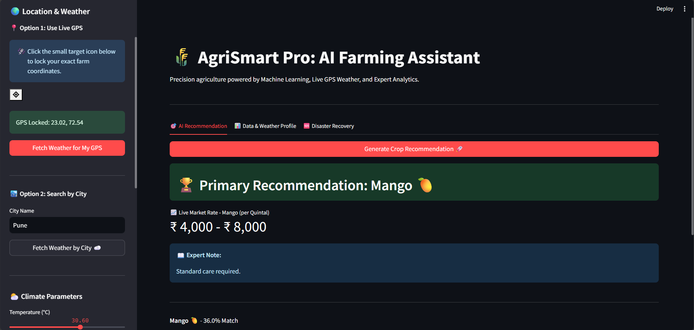
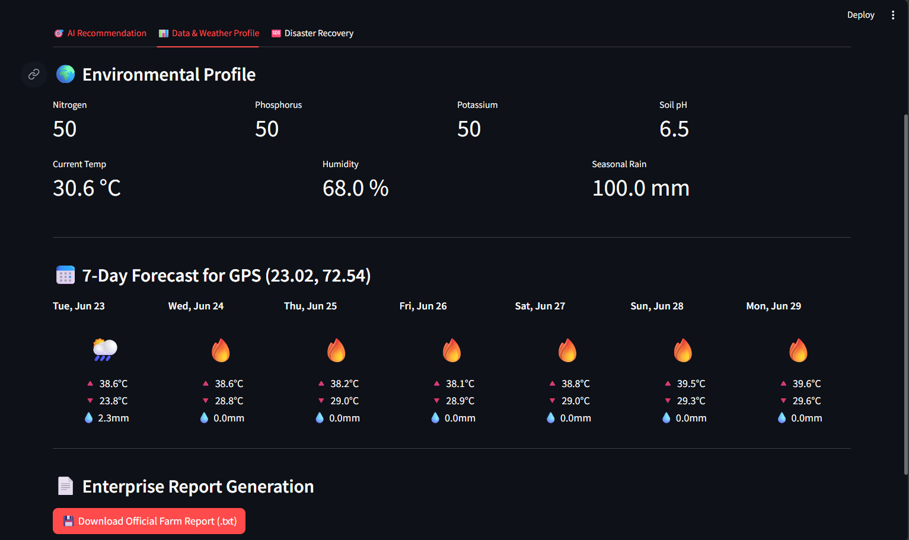
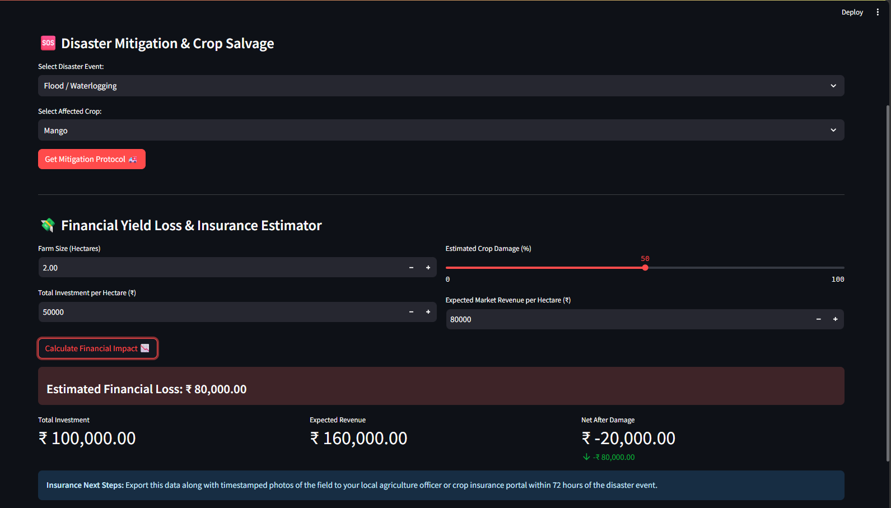

# 🌾 AgriSmart Pro: AI Farming Assistant


**Precision agriculture powered by Machine Learning, Live GPS Weather, and Expert Analytics.**

AgriSmart Pro is an enterprise-grade web application designed to empower farmers with data-driven decision-making. By combining localized soil metrics with live weather forecasting, it provides highly accurate crop recommendations, disaster mitigation strategies, and financial impact estimations. 

This platform bridges the gap between traditional farming and Agriculture 4.0, offering a scalable, multi-lingual solution for rural environments.

---

## ✨ Core Features

* **🎯 AI-Powered Crop Recommendation:** Utilizes a trained Machine Learning model (99%+ accuracy) to recommend the optimal crop based on Nitrogen, Phosphorus, Potassium, pH, temperature, humidity, and rainfall.
* **🌍 Live GPS & City Weather:** Integrates with the Open-Meteo API to fetch real-time climate data using live browser GPS coordinates or manual city search.
* **📅 Predictive Early Warning System:** Analyzes a 7-day visual weather forecast to silently detect and alert farmers of impending heatwaves (>40°C) or severe floods (>50mm rain).
* **🆘 Disaster Mitigation & Crop Salvage:** Provides actionable, emergency triage protocols for floods, droughts, pests, and frost tailored to specific crops.
* **💸 Financial Yield Loss Estimator:** Calculates exact financial impact and net loss after a disaster to help farmers file accurate PMFBY insurance claims.
* **📈 Live Market Intelligence:** Displays current simulated Mandi prices (₹ per Quintal) for the recommended crops to ensure financial viability.
* **🌐 One-Click Localization:** Dynamically translates the entire platform into English, Hindi, Marathi, and Gujarati using the `deep-translator` API to ensure accessibility for rural farmers.
* **📄 Enterprise Report Generation:** Exports a comprehensive, timestamped `.txt` report of environmental data and AI recommendations for official record-keeping.

---

## 📸 Platform Screenshots

### 1. Main Dashboard & AI Recommendation

*The core interface featuring GPS locking, soil metric sliders, and the primary AI crop recommendation with live market rates.*

### 2. 7-Day Visual Forecast & Data Profile

*A mobile-friendly 7-day visual weather forecast and complete environmental profile summary.*

### 3. Financial Yield Loss Estimator

*The enterprise tool for calculating post-disaster financial impact and generating metrics for insurance claims.*

---

## 🚀 Installation & Setup

Follow these steps to run AgriSmart Pro on your local machine:

### Prerequisites
* Python 3.8 or higher installed on your system.
* Git installed.

**1. Clone the Repository**
```bash
git clone [https://github.com/KushalShah2512/AgriSmart-AI-Platform.git](https://github.com/KushalShah2512/AgriSmart-AI-Platform.git)
cd AgriSmart-AI-Platform